# Чат-бот Telegram танцевальной академии "King Step Syndicate"
Чат-бот дает возможность пользователю полностью ознакомиться с информацией про танцевальную академию King Step Syndicate и записаться на первое занятие:
- информация о преподавателях (+фото)
- танцевальные стили (+видео к каждому стилю)
- расписание занятий
- стоимость абонементов
- локация и залы
- контакты (сообщество академии вк и контакты всех преподавателей)
- достижения


## Содержание
- [Использование](#использование)
- [Описание файлов проекта](#описание-файлов-проекта)
- [Технические возможности](#технические-возможности)
- [Пример диалога](#пример-диалога)
- [Примеры работы кода. Скриншоты](#примеры-работы-кода-скриншоты)
- [Contributing](#contributing)
- [To do](#to-do)
- [Создатель проекта](#создатель-проекта)


## Использование

1. Установка Python и pip:
- Скачайте и установите Python (выберите последнюю версию).
- Во время установки убедитесь, что включена опция "Add Python to PATH".
2. Создание виртуального окружения:
- Откройте командную строку (Windows PowerShell или CMD).
- Перейдите в папку с проектом:
- Установите npm-пакет с помощью команды:
```sh
 cd путь\до\botKSS1
```
- Создайте виртуальное окружение:
```
python -m venv venv
venv\Scripts\activate
```
3. Установка зависимостей
```
pip install -r requirements.txt
```
4. После клонирования репозитория добавьте токен в файл config.py, полученный от BotFather и список id Telegram администраторов
```sh
 API = ''
 admins = []
```
5.Запуск бота
```commandline
python main.py
```

## Описание файлов проекта
1. Директория \files - файлы в формате .png, .jpg
2. Директория \files\video - файлы в формате .mp4
3. Python file config.py - токен бота и список id администраторов
4. Python file database.py - подключение к базе данных, функции с sql запросами на создание двух таблиц (users, sign_up), функции с sql запросами на получение информации с таблицы users
5. Текстовый file database.db - база данных с двумя таблицами - users, sign_up
6. Python file handlers.py - асинхронные функции для ответа пользователю
7. Python file keyboards.py - reply и inline клавиатуры
8. Python file main.py - подключение бота, хэндлеры для обработки сообщений, запуск бота
9. Текстовый file requirements.txt - файл зависимостей
10. Python file texts.py - текст для кнопок бота


## Технические возможности

1. Вся информация о пользователях сохраняется в базе данных (database.db) sqlite3, таблица users
2. На основании данной таблицы администратор может проверить статистику посещений, получить список пользователей, 
осуществить рассылку анонса (фото + информация)
3. Запись на первое занятие сохраняется в базе данных (database.db) sqlite3, таблица sign_up
4. Администратор получает уведомление о записи на занятие с полной информацией:
- имя пользователя в Telegram
- фамилия, имя
- возраст
- стиль танца, который заинтересовал 
- дата посещения

### Пример диалога
1. Пользователь:
   > 📌 Танцевальные направления
2. Бот:
   >  **Выберите стиль ⬇️⬇️⬇️**  
   > **Hip=hop**\
   > **Krump**\
   > **Afro**\
   > **K-pop**\
   > **High Heels**\
   > **Waacking**

3. Пользователь:

   > **High Heels**  
2. Бот:
   >  *Video*\
   > 👠High Heels - это танец на высоких каблуках или шпильках, который зародился в Лос-Анджелесе благодаря хореографу Энди Джею (Andye J), станцевавшей на каблуках Hip-Hop. 
Далее инициативу поддержала ее коллега из Нью-Йорка - легендарная Шерил Мураками.
Будучи танцем совершенно новым, High Heels не имеет собственной танцевальной базы как таковой. Движения, пластика, манера и музыкальность были заимствованы для хореографии на каблуках из других направлений. 
Это дает практически полную свободу хореографам в их постановках. В этом стиле нет жестких рамок в движениях, но есть возрастное ограничение – 16 лет. 
Танцоры, выступающие в этом направлении, снимают с себя зажатость, учатся уверенности в своей красоте и восстановлению внутренней гармонии.
     

---

## Примеры работы кода. Скриншоты

1. Начало работы бота

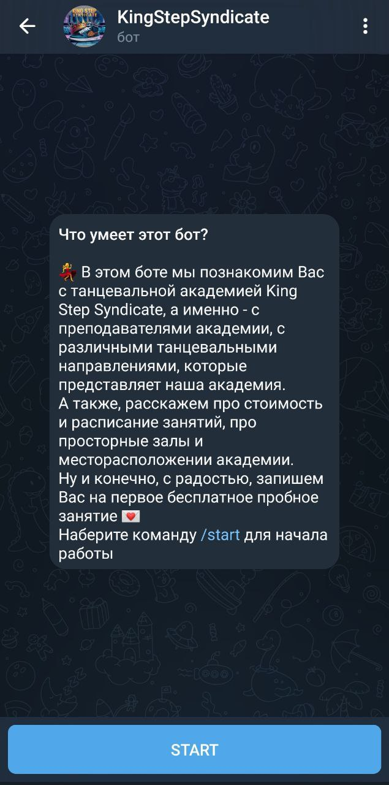

2. Команда /start. Приветствие пользователя

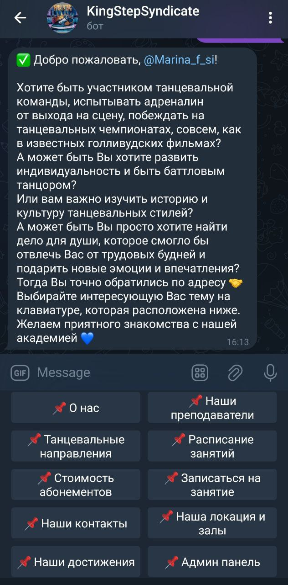

При приветствии пользователя, бот сразу записывает id и username пользователя в базу данных, таблица users

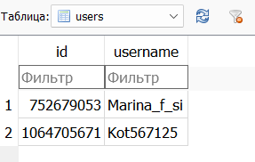

3. Нажатие кнопки "📌 О нас"

Бот отправляет описание про танцевальную академию с фотографией

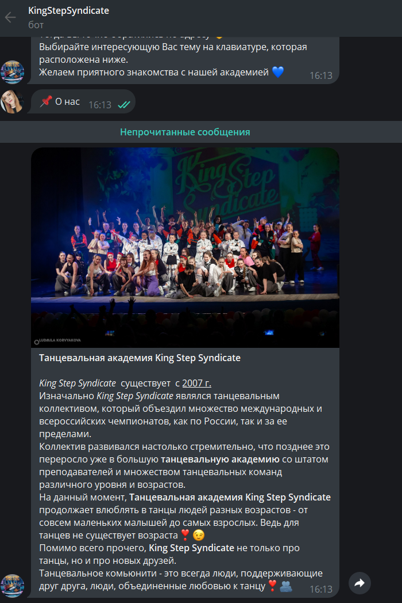

4. Нажатие кнопки "📌 Наши преподаватели"

Бот предлагает выбрать преподавателя

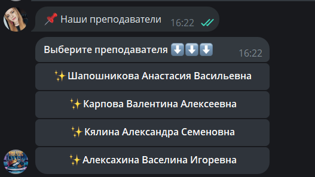

5. Нажатие кнопки "Шапошникова Анастасия Васильевна"

Бот рассказывает про преподавателя и прикрепляет фотографию

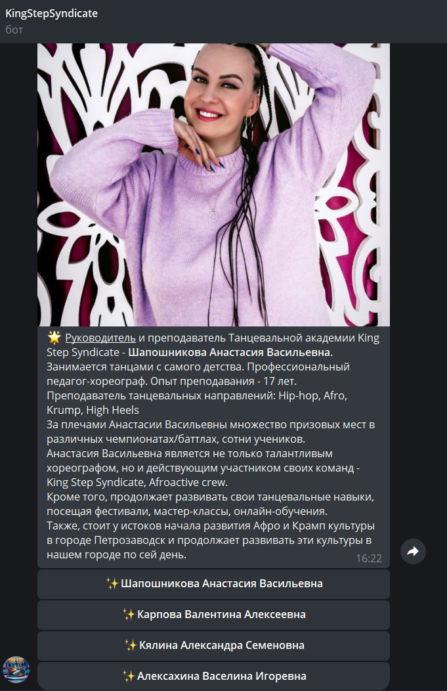

6. Нажатие кнопки "📌 Танцевальные направления"

Бот предлагает выбрать танцевальный стиль

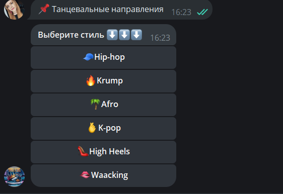

7. Нажатие кнопки "🧢Hip-hop"

Бот отправляет описание стиля и прикрепляет видео


8. Нажатие кнопки "📌 Расписание занятий"

Бот отправляет таблицу с расписанием занятий и пояснения, в какие группы может записаться пользователь

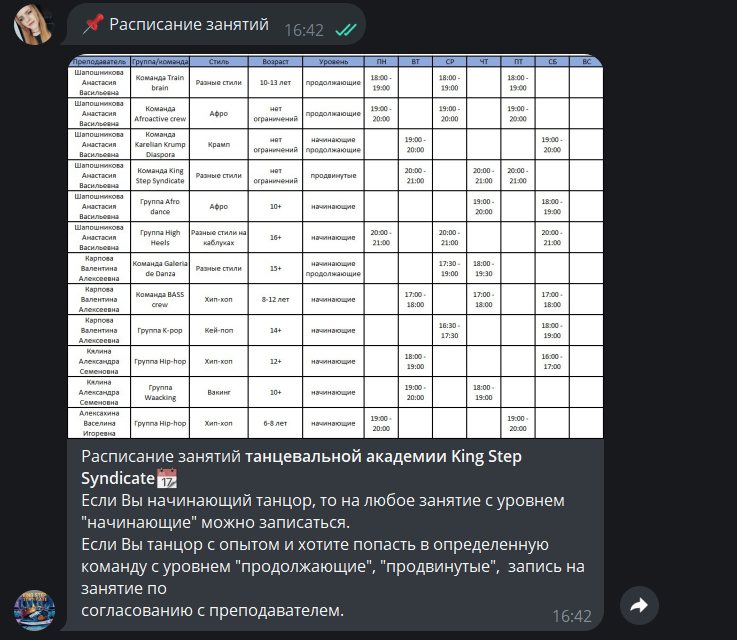

9. Нажатие кнопки "📌 Стоимость абонементов"

Бот отправляет таблицу со стоимостью абонементов и пояснения


10. Нажатие кнопки "📌 Записаться на занятие"

Бот уточняет фамилию, имя, возраст, танцевальный стиль, заинтересовавший пользователя и дату, когда пользователь хочет 
посетить первое пробное занятие

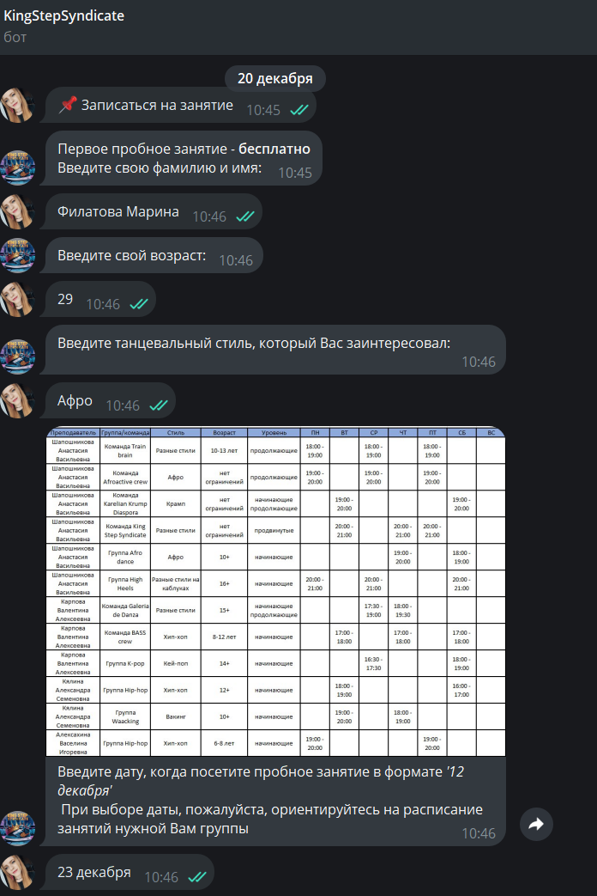

После чего отправляет уведомление администратору о записи

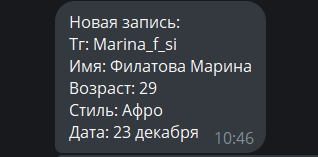

Также отвечает пользователю, что он записан на определенную дату

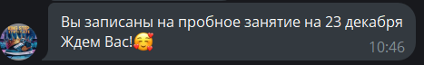

И добавляет запись в базу данных, в таблицу sign_up

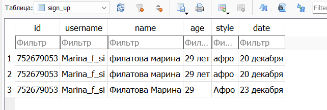

11. Нажатие кнопки "📌 Наши контакты"

Бот отправляет ссылки на: сообщество академии в вк, страницы Вк и телеграм всех преподавателей

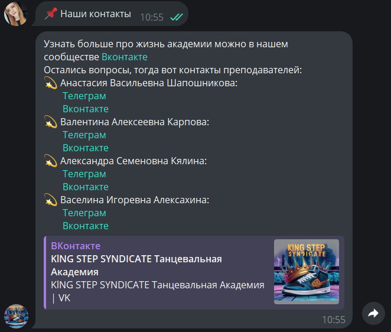

12. Нажатие кнопки "📌 Наша локация и залы"

Бот отправляет фотографию залов, адрес (гиперссылка на гугл карты) и пояснения, как найти академию

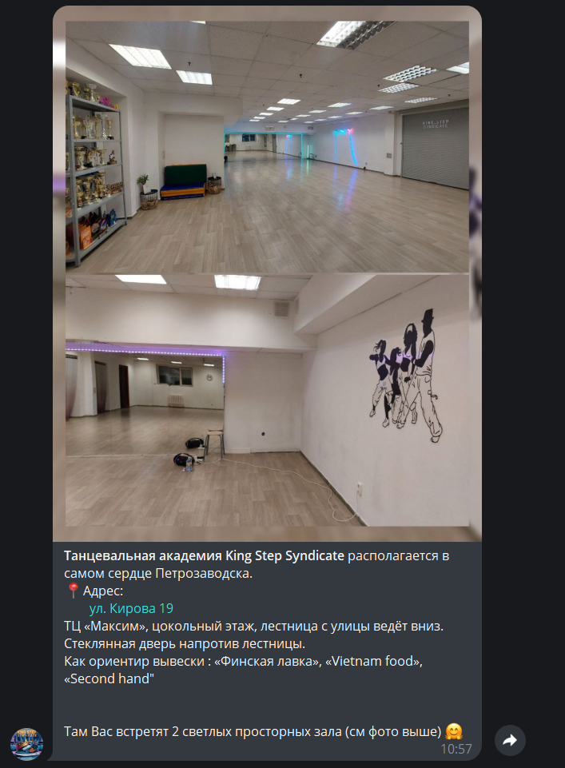

13. Нажатие кнопки "📌 Наши достижения"

Бот отправляет фотографию кубков и небольшую вырезку из послужного списка в качестве описания

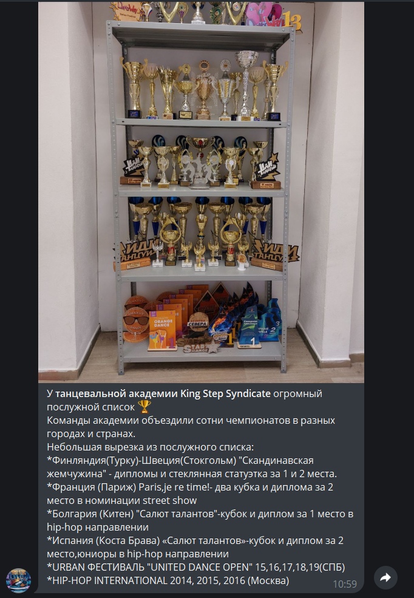

14. Нажатие кнопки "📌 Админ панель"

Кнопка доступна только для администраторов

Бот информирует о том, что пользователь перешел в админ панель и предлагает выбрать действие

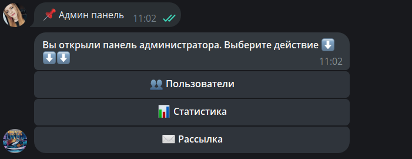

15. Нажатие кнопки "👥 Пользователи"

Бот высылает список пользователей - их id и username

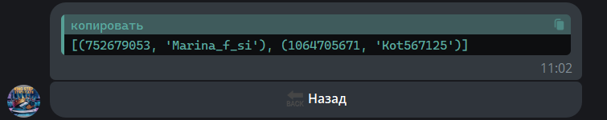

16. Нажатие кнопки "📊 Статистика"

Бот отправляет количество пользователей бота

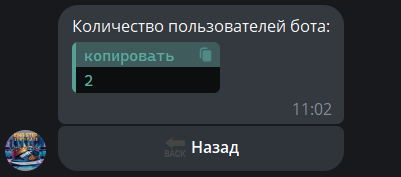

17. Нажатие кнопки "✉️ Рассылка"

Бот просит ввести текст сообщения и прикрепить фотографию.
Далее производит рассылку всем пользователям и уведомление об успешной рассылке со статистикой администраторам

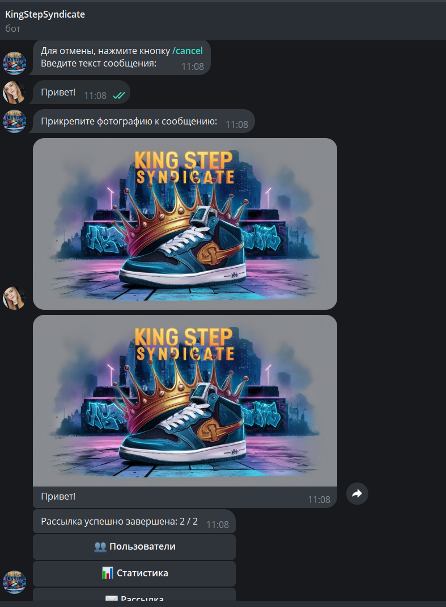


## Contributing
Предложение по разработке проекта можно направить разработчику проекта в Telegram


### Цель проекта
Проект был разработан с целью оптимизации и автоматизации взаимодействия с потенциальными учениками танцевальной академии.
На все вопросы потенциального ученика (на которые обычно отвечают преподаватели академии)
теперь может ответить бот.

## To do
- [ ] Добавить функционал в админ панель - редактирование информации в чат-боте


## Создатель проекта
Для любых вопросов и предложений, обращайтесь к разработчику проекта в Telegram:

- [Филатова_Марина](https://t.me/Marina_f_si) 

